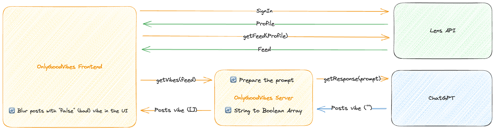

# OnlyGoodVibes 🤗

## The "bad vibes-free" social network

This project is an **MVP** of a social network that eliminates all the bad vibes from your [Lens Protocol](https://www.lens.xyz/) feed.

When you connect your wallet, OnlyGoodVibes will fetch your default Lens feed (already created by the Lens API). Then it will ask ChatGPT to send a feedback for each post (true => good vibe, false => bad vibe).

All messages considered like "bad vibe" or "neutral vibe"(1) are then blurred out on the UI.

> (1) : As OnlyGooVibes is an MVP, the aim is to showcase the concept. By including neutral vibes I multiply my chances of there being blurred content in the feed, allowing everyone to see how it works.

<br/>



## Project Usage

### Install dependencies

```bash
# install frontend / backend dependencies
yarn
```

### Set your OpenAI API key

```bash
cp .env.local.example .env.local
# set the OPENAI_API_KEY variable with your own OpenAI API key in the freshly created .env file
source .env
```

### Start the app

```bash
# this will start your Next.js app
# the frontend is available on http://localhost:3000/
# it also starts a local backend
yarn dev
```

Then, the app will be running on http://localhost:3000.
